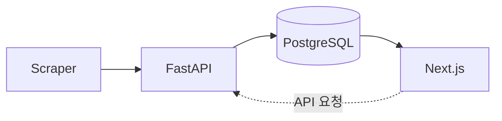

# DICEE

DICEE는 대학 공지 데이터를 수집·정규화해, 필요한 정보를 더 빠르게 찾을 수 있게 만드는 공지 인텔리전스 백엔드입니다.

현재 상태: **M2 (Intelligence)** — 크롤러 안정화 및 AI 파이프라인 기반을 구축 중입니다.

## Key Features

- **공지 통합 수집**: 단과대/학과별로 분산된 공지를 하나의 API로 일관되게 제공합니다.
- **중복·재처리 최소화**: `content_hash` 기반 변경 감지와 upsert 정책으로 불필요한 재처리를 줄입니다.
- **운영 안정성 중심 크롤링**: 재시도, 레이트 리밋, 트리거 멱등성, 분산 락, 큐 기반 실행을 기본 설계에 포함합니다.
- **AI 파이프라인 대응 구조**: `notice_id` 중심 전달 방식으로 구조화 추출·매칭 파이프라인을 확장 가능하게 유지합니다.
- **보안 우선 내부 제어**: 내부 트리거 헤더 인증, OAuth/JWT 인증, Redis 장애 시 fail-closed 옵션을 제공합니다.
- **유연한 DB 연결**: `asyncpg` 및 `psycopg` 드라이버를 모두 지원하며, 클라우드 환경(Railway 등)을 고려한 SSL 쿼리 자동 정규화 로직을 포함합니다.

## Tech Stack

| Category | Stack |
|---|---|
| **Frontend** | Next.js (로드맵 기준, Vercel 배포 대상) |
| **Backend** | FastAPI, SQLAlchemy 2.0, Celery, Pydantic v2, Alembic |
| **Database** | PostgreSQL, Redis |
| **Infrastructure** | Docker/Compose, Railway, Vercel, Sentry |

## Architecture



운영 관점에서는 Celery Worker와 Redis Queue가 크롤링 실행을 담당하고, FastAPI는 API 제공 및 오케스트레이션을 담당합니다.

## Getting Started (5 minutes)

### 1) 저장소 클론

```bash
git clone <YOUR_REPO_URL>
cd DICEE-1
```

### 2) 환경 변수 파일 생성

Linux/macOS:

```bash
cp .env.example .env
```

Windows PowerShell:

```powershell
Copy-Item .env.example .env
```

로컬 Docker 실행 기준 권장값:

- `ENVIRONMENT=development`
- `APP_ENTRY=api` (`worker`는 Compose에서 자동으로 `APP_ENTRY=celery` 오버라이드)

### 3) Docker Compose로 전체 스택 실행

```bash
docker compose up --build -d
```

실행 구성:

- `db` (PostgreSQL)
- `redis`
- `migrate` (`alembic upgrade head` 1회 실행)
- `api` (`:8000`)
- `worker` (Celery)

### 4) 헬스체크 확인

```bash
curl http://localhost:8000/health
```

예상 응답:

```json
{"status":"ok"}
```

### 5) API 문서 확인

- Swagger UI: `http://localhost:8000/docs`

### 자주 쓰는 명령어

```bash
# 로그 확인
docker compose logs -f api
docker compose logs -f worker

# 종료
docker compose down

# 종료 + 볼륨 삭제
docker compose down -v
```

## Project Docs

- [Roadmap](docs/ROADMAP.md)
- [Phase Playbook](docs/ROADMAP_PHASES.md)
- [Deployment](docs/DEPLOYMENT.md)
- [Work Log](docs/WORK_LOG.md)
- [Cautions](docs/CAUTIONS.md)
