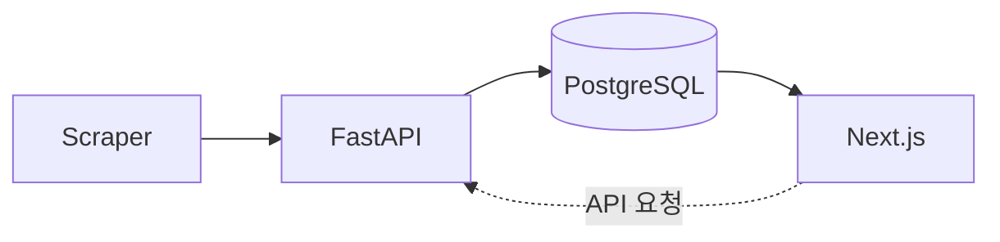

# DICEE

DICEE는 대학 공지 데이터를 수집·정규화해, 필요한 정보를 더 빠르게 찾을 수 있게 만드는 공지 인텔리전스 백엔드입니다.

현재 상태(마지막 코드/문서 기준 반영: **2026-04-26**, 상세: `docs/WORK_LOG.md`):

- **완료**: M2 (Intelligence) 핵심 — 3·4단계(크롤·Celery·AI 추출·taxonomy) + **5단계 코어**(프로필·맞춤 피드·달력·ICS·`notice_schedules` 동기화) API 반영
- **진행 중/잔여**: **PostgreSQL FTS·GIN 키워드 검색**(후속 PR), **프론트엔드(Next.js, 6단계)**는 아직 미생성/미착수 (`frontend/` 없음)

## Key Features

- **공지 통합 수집**: 단과대/학과별로 분산된 공지를 하나의 API로 일관되게 제공합니다.
- **공개 조회 API**: `GET /v1/notices`·`GET /v1/notices/{id}`·`POST /v1/notices/search/semantic`(임베딩 기반 검색).
- **로그인 유저·맞춤·달력**: `GET`/`PATCH /v1/users/me`, `GET /v1/meta/department-options`·`grade-options`, 맞춤 목록 `GET /v1/notices/matched`, `GET /v1/calendar/events`·`GET /v1/calendar/feed.ics`, 고정 일정 `POST`/`DELETE /v1/users/me/calendar/events/...`. 학과 코드는 `app/data/department_catalog.json`. 상세는 [docs/ROADMAP_PHASES.md](docs/ROADMAP_PHASES.md) 5단계·[user-notice-matching-and-api-contracts.md](docs/decisions/user-notice-matching-and-api-contracts.md).
- **중복·재처리 최소화**: `content_hash` 기반 변경 감지와 upsert 정책으로 불필요한 재처리를 줄입니다.
- **운영 안정성 중심 크롤링**: 재시도, 레이트 리밋, 트리거 멱등성, 분산 락, 큐 기반 실행을 기본 설계에 포함합니다.
- **AI 파이프라인 대응 구조**: `notice_id` 중심 전달 방식으로 구조화 추출·매칭 파이프라인을 확장 가능하게 유지합니다.
- **보안 우선 내부 제어**: 내부 트리거 헤더 인증, OAuth/JWT 인증, Redis 장애 시 fail-closed 옵션을 제공합니다.

## Tech Stack

| Category | Stack |
|---|---|
| **Frontend** | Next.js (로드맵 기준, Vercel 배포 대상) |
| **Backend** | FastAPI, SQLAlchemy 2.0, Celery, Pydantic v2, Alembic |
| **Database** | PostgreSQL, Redis |
| **Infrastructure** | Docker/Compose, Railway, Vercel, Sentry |

로컬 개발 전제(요약): **Python 3.11+** (`pyproject.toml`의 `requires-python`과 동일), PostgreSQL, Redis.

## Architecture



운영 관점에서는 Celery Worker와 Redis Queue가 크롤링 실행을 담당하고, FastAPI는 API 제공 및 오케스트레이션을 담당합니다.

## Getting Started (5 minutes)

### 1) 저장소 클론

```bash
git clone <YOUR_REPO_URL>
cd DICEE-1
```

### 2) 환경 변수 파일 생성

Linux/macOS:

```bash
cp .env.example .env
```

Windows PowerShell:

```powershell
Copy-Item .env.example .env
```

로컬 Docker 실행 기준 권장값:

- `ENVIRONMENT=development`
- `APP_ENTRY=api` (`worker`는 Compose에서 자동으로 `APP_ENTRY=celery` 오버라이드)

### 3) Docker Compose로 전체 스택 실행

```bash
docker compose up --build -d
```

실행 구성:

- `db` (PostgreSQL)
- `redis`
- `migrate` (`alembic upgrade head` 1회 실행)
- `api` (`:8000`)
- `worker` (Celery)

### 4) 헬스체크 확인

엔드포인트 역할이 다르다. 운영·배포 상세는 [docs/DEPLOYMENT.md](docs/DEPLOYMENT.md), GitHub/Railway/Sentry 게이트는 [docs/RUNBOOK_DEPLOY.md](docs/RUNBOOK_DEPLOY.md), 절차 모음은 [docs/runbooks/](docs/runbooks/)를 본다.

| 경로 | 용도 |
|------|------|
| **`GET /health`** | 로드밸런서·Railway 등 **프로세스 기동** 확인만. DB·Redis는 검사하지 않는다. |
| **`GET /live`** | Liveness. 프로세스 생존만 (재시작 유도용). |
| **`GET /ready`** | Readiness. DB·Redis(blocklist·trigger_lock) 준비 시 200, 아니면 503. Redis가 켜져 있으면 워커가 기록한 **`last_crawl_success`** 스냅샷이 본문에 포함될 수 있다. |
| **`GET /health/worker`** | Celery 브로커 기준 워커 ping. 설정된 최소 활성 워커 수 미만이면 503. |

```bash
curl -s http://localhost:8000/health
curl -s -w "\nHTTP %{http_code}\n" http://localhost:8000/ready
curl -s -w "\nHTTP %{http_code}\n" http://localhost:8000/health/worker
```

`/health` 예시 응답:

```json
{"status":"ok"}
```

### 5) API 문서 확인

- Swagger UI: `http://localhost:8000/docs`

### 자주 쓰는 명령어

```bash
# 로그 확인
docker compose logs -f api
docker compose logs -f worker

# 종료
docker compose down

# 종료 + 볼륨 삭제
docker compose down -v
```

## 품질·회귀

- `main`은 PR + CI green 후 머지 ([RUNBOOK_DEPLOY.md](docs/RUNBOOK_DEPLOY.md)의 GitHub 보호 규칙).
- 버그픽스 PR에는 같은 PR에 회귀 테스트 최소 1개. 우선순위 목록: [tests/CRITICAL_PATHS.md](tests/CRITICAL_PATHS.md).
- 로컬 빠른 루프: `pytest -m "not integration"` (통합은 `DATABASE_URL` 있을 때).

## Project Docs

- [문서 인덱스](docs/README.md)
- [GSTACK.md](GSTACK.md) — 기본 납품 워크플로(gstack 스킬, 품질 게이트)
- [Roadmap](docs/ROADMAP.md)
- [Phase Playbook](docs/ROADMAP_PHASES.md)
- [Deployment](docs/DEPLOYMENT.md)
- [Work Log](docs/WORK_LOG.md)
- [Cautions](docs/CAUTIONS.md)
